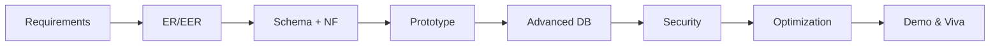

# Database Management System

Theory undergraduate course in database modeling, SQL, normalization, transactions and intelligent data applications.

## Philosophy

Databases are learned by stating a requirement, modeling it, implementing it, breaking it, and explaining the result.

Our learning loop is:

> **Problem → Model → Design → Query → Execute → Analyze → Break → Optimize → Explain**

For database design:

> **Requirement → Entities → Relationships → Constraints → ER Diagram → Relational Schema → Normalize → Implement → Query → Validate**

For SQL:

> **Question → Think in Sets → Write Query → Predict Result → Execute → Explain → Optimize**

The objective is not to memorize syntax or normal-form slogans.

The objective is to learn how to **think with data**.

---

## Course Details

| Field | Value |
| --- | --- |
| Course title | Database Management System |
| Course code | CSL0311[T] |
| Semester | 3rd Semester |
| Course type | Theory |
| Category | Discipline Core |
| L-T-P | 2-0-0 |
| Credits | 2 |
| Lab dialect | PostgreSQL (ANSI SQL first; PostgreSQL-only syntax is marked) |

---

## Course Outcomes

Full statements: [COURSE-OUTCOMES.md](COURSE-OUTCOMES.md)

| CO | Students will be able to | Bloom |
| --- | --- | --- |
| CO1 | Understand and implement modern database concepts and AI-assisted DB modeling/design | BL2 Understand |
| CO2 | Understand and implement databases using SQL and Relational Algebra | BL3 Apply |
| CO3 | Design and fine-tune efficient databases using normalization principles | BL4 Analyze |
| CO4 | Understand and apply transactions, concurrency control and distributed database concepts | BL4 Analyze |
| CO5 | Design and implement databases for real-life intelligent database applications | BL5 Evaluate |

---

## Units

| Unit | Title | Lectures folder |
| --- | ---: | --- |
| 1 | Database Foundations and ER Modeling | [week-01 to week-04](lectures) |
| 2 | Relational Model, Relational Algebra and SQL | [week-05, week-06, week-09, week-10](lectures) |
| 3 | Database Design and Normalization | [week-07 to week-08](lectures) |
| 4 | Transactions | [week-11 to week-12](lectures) |
| 5 | Concurrency Control and Query Optimization | [week-12 to week-13](lectures) |

Official unit order is preserved in naming. Delivery is aligned to PBL due dates so ER is taught before 22 Sep, 1NF–BCNF before 6 Oct, SQL depth before 20 Oct, and transactions before 30 Oct. No syllabus topic is dropped. Full map: [SYLLABUS-TRACEABILITY.md](SYLLABUS-TRACEABILITY.md).

---

## Folder Structure

```text
Database-Management-System/
├── README.md
├── COURSE-OUTCOMES.md
├── curriculum-overview.md
├── SYLLABUS-TRACEABILITY.md
├── AI-USAGE-POLICY.md
├── PBL-GUIDELINES.md
├── SUBMISSION-SCHEDULE.md
├── ACCESS-MODEL.md
│
├── lectures/
│   ├── week-01-database-foundations/
│   ├── week-02-er-modeling/
│   ├── week-03-extended-er-and-mapping/
│   ├── week-04-cloud-distributed-and-pbl/
│   ├── week-05-relational-model-and-algebra/
│   ├── week-06-algebra-queries-and-pbl/
│   ├── week-07-normalization-core/
│   ├── week-08-advanced-normalization-and-pbl/
│   ├── week-09-sql-core/
│   ├── week-10-sql-ai-and-pbl/
│   ├── week-11-transactions/
│   ├── week-12-concurrency-and-pbl/
│   ├── week-13-optimization-and-finals/
│   ├── week-14-revision-foundations/
│   ├── week-15-revision-transactions/
│   └── week-16-exam-studio/
│
├── labs/
├── sql-practice/
├── er-modeling/
├── normalization-exercises/
├── transaction-exercises/
├── query-optimization/
├── assignments/
├── assessments/
├── pbl/
├── student/
├── faculty/
├── portal/
├── config/
└── resources/
```

Each session folder contains:

- `student-reference.md` — problem, mental model, example, trace, mistakes, practice
- `instructor-guide.md` — 50–60 minute teaching plan
- `lab.md` — paper / SQL / diagram practice with test cases

---

## Two entry points

| Who | Open this |
| --- | --- |
| Students | [student/index.md](student/index.md) · [portal/student.html](portal/student.html) |
| Faculty | [faculty/index.md](faculty/index.md) · [portal/faculty.html](portal/faculty.html) |

GitHub does not hide folders in a public repository. Read [ACCESS-MODEL.md](ACCESS-MODEL.md).

---

## Teaching Material

Index with links: [curriculum-overview.md](curriculum-overview.md)

Typical 50–60 minute theory session:

```text
0–8 min      hook / recap
8–22 min     problem and mental model
22–38 min    worked example (ER / RA / SQL / schedule)
38–50 min    lab / pair activity
50–55 min    common mistakes
55–60 min    exit question
```

This is a 2-0-0 theory course. `lab.md` files are in-class or take-home practice, not a credited practical.

---

## PBL — Project-Based Learning

**Design & Development of a Real-World Database-Driven Application**

| | |
| --- | --- |
| Duration | 10 weeks |
| Team size | **4–5 students** |
| Weightage | **100 marks** (+ optional 5 cloud bonus) |



| Resource | Link |
| --- | --- |
| PBL overview | [pbl/README.md](pbl/README.md) |
| Student guidelines | [PBL-GUIDELINES.md](PBL-GUIDELINES.md) |
| Project bank | [pbl/projects/project-bank.md](pbl/projects/project-bank.md) |
| 10-week timeline | [pbl/TIMELINE.md](pbl/TIMELINE.md) |
| Submission schedule | [SUBMISSION-SCHEDULE.md](SUBMISSION-SCHEDULE.md) |
| Rubrics | [pbl/rubrics/student-rubric.md](pbl/rubrics/student-rubric.md) · [faculty](pbl/rubrics/faculty-rubric.md) |
| Templates | [pbl/templates/](pbl/templates/) |
| CO mapping | [pbl/CO-MAPPING.md](pbl/CO-MAPPING.md) |
| Student portal | [student/index.md](student/index.md) · [portal/student.html](portal/student.html) |
| Faculty portal | [faculty/index.md](faculty/index.md) · [portal/faculty.html](portal/faculty.html) |

**S1** opens **25 Aug 2026**. **S6** final due **06 Nov 2026**. Demo/viva **07–09 Nov 2026**.

---

## AI-Tool Usage Policy

The syllabus exposes students to schema copilots and NL-to-SQL tools. Students remain responsible for every design decision and query.

Read [AI-USAGE-POLICY.md](AI-USAGE-POLICY.md).

---

## Assessment

| Component | Marks |
| --- | ---: |
| Internal | 40 |
| External | 60 |
| Total | 100 |

PBL is part of internal assessment. Materials: [assessments/](assessments/)

---

## Schedule

See [curriculum-overview.md](curriculum-overview.md).

---

## Official Learning Resources

Listed in [resources/learning-resources.md](resources/learning-resources.md). Do not copy copyrighted textbook content.
