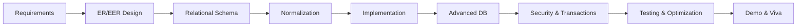

# Project Based Learning — DBMS

**CSL0311[T] · Design & Development of a Real-World Database-Driven Application**

| | |
| --- | --- |
| Duration | 10 weeks |
| Mode | Team-based (4–5 students) |
| Weightage | 100 marks (+ optional 5 cloud bonus) |
| GitHub | Mandatory |

---

## Introduction

The PBL exposes students to the **complete lifecycle** of a real database system. The database remains the primary engineering artifact — not a CRUD website with a database attached.

Forbidden as the main deliverable unless faculty rewrites constraints:

- generic Library Management with no reservation/fine concurrency
- generic Student Management with no examination/integrity rules
- UI-only projects with trivial schema

---

## Why this PBL exists

Undergraduate DBMS theory (ER, SQL, normalization, transactions) must connect to **engineering practice**: SRS, schema design, implementation, security, concurrency, optimization, and defense in viva.

---

## Learning objectives

Students must demonstrate ability to:

- Analyze a real-world problem and produce a formal SRS
- Design ER/EER models and map to relational schemas
- Apply normalization (1NF–BCNF where applicable)
- Implement DDL/DML with meaningful test data
- Integrate the database with a **Web app, CLI, or REST API**
- Implement views, stored procedures/functions, triggers, transactions
- Model ACID and concurrency scenarios
- Implement RBAC and parameterized queries (SQL injection defense)
- Optimize queries with EXPLAIN / EXPLAIN ANALYZE evidence
- Maintain professional Git history and defend decisions in viva

Full list: [../PBL-GUIDELINES.md](../PBL-GUIDELINES.md)

---

## Team structure

| Field | Required |
| --- | --- |
| Team ID | Yes |
| Team Name | Yes |
| Members + roll numbers | Yes |
| Team Lead | Yes |
| GitHub repository owner | Yes |
| Selected domain / project | Yes |
| Faculty mentor | Yes |
| Ground rules | Yes |

Roles **rotate** across stages. Every student contributes to SQL, documentation, implementation, and presentation.

Templates: [templates/](templates/)

---

## Stages (S1–S7)

| Stage | Marks | Due 2026 |
| --- | ---: | --- |
| [S1](student/SUBMISSION-INSTRUCTIONS.md#s1) Requirement Analysis & SRS | 10 | 08 Sep |
| [S2](student/SUBMISSION-INSTRUCTIONS.md#s2) ER, Normalization & DDL | 15 | 06 Oct |
| [S3](student/SUBMISSION-INSTRUCTIONS.md#s3) Working Prototype | 20 | 20 Oct |
| [S4](student/SECURITY-AUDIT-GUIDE.md) Advanced DB & Security | 15 | 30 Oct |
| [S5](student/SUBMISSION-INSTRUCTIONS.md#s5) Testing & Optimization | 15 | 04 Nov |
| [S6](student/PRESENTATION-GUIDELINES.md) Final Report, Demo & Viva | 15 | 06 Nov |
| [S7](student/SUBMISSION-INSTRUCTIONS.md#s7) Peer / Individual Contribution | 10 | 09 Nov |

Schedule: [../SUBMISSION-SCHEDULE.md](../SUBMISSION-SCHEDULE.md) · Calendar JSON: [../config/course-calendar.json](../config/course-calendar.json)

---

## 10-week timeline

[TIMELINE.md](TIMELINE.md)

---

## Assessment

- Student rubric: [rubrics/student-rubric.md](rubrics/student-rubric.md)
- Faculty rubric: [rubrics/faculty-rubric.md](rubrics/faculty-rubric.md)
- CO mapping (official CO1–CO5): [CO-MAPPING.md](CO-MAPPING.md)

---

## Project bank

[projects/project-bank.md](projects/project-bank.md) · Faculty allocation: [projects/team-allocation.md](projects/team-allocation.md)

---

## Student resources

| Resource | Link |
| --- | --- |
| Guidelines | [../PBL-GUIDELINES.md](../PBL-GUIDELINES.md) |
| Submission instructions | [student/SUBMISSION-INSTRUCTIONS.md](student/SUBMISSION-INSTRUCTIONS.md) |
| Templates | [templates/](templates/) |
| Security red-team | [student/SECURITY-AUDIT-GUIDE.md](student/SECURITY-AUDIT-GUIDE.md) |
| Pre-submission checklist | [templates/pre-submission-checklist.md](templates/pre-submission-checklist.md) |
| AI policy | [../AI-USAGE-POLICY.md](../AI-USAGE-POLICY.md) |
| Student portal | [../portal/student.html](../portal/student.html) |

---

## Faculty resources

| Resource | Link |
| --- | --- |
| Faculty portal | [../portal/faculty.html](../portal/faculty.html) |
| Weekly checkpoints | [faculty/WEEKLY-CHECKPOINT.md](faculty/WEEKLY-CHECKPOINT.md) |
| Submission links | [submissions/SUBMISSION-LINKS.md](submissions/SUBMISSION-LINKS.md) |
| Faculty dashboard | [../faculty/index.md](../faculty/index.md) |

---

## Recognition badges (non-grade)

- Best Schema Design
- Most Secure System
- Best Optimization Gain
- Best GitHub Practice
- Best Database Engineering
- Best Technical Defense

Optional **cloud deployment bonus**: up to **5 marks** separate from the 100 — see [../PBL-GUIDELINES.md](../PBL-GUIDELINES.md#cloud-bonus).
